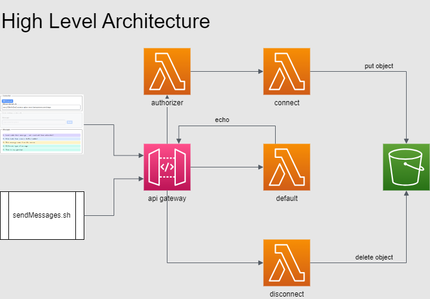

# NextJS with AWS Api Gateway secured WebSocket

Warning:
This repo does not consider AWS free-tier constraints and may induce costs when using it.

## Introduction

This is a portfolio project in which a NextJS web client opens a secured WebSocket on AWS Api Gateway and receives messages.

The main functionalities presented in this repository are:

- Build and deploy AWS backend infrastructure;
- Run the NextJS client application which connects to the secure WebSocket;
- Send messages from frontend to backend - which are echod back to the frontend;
- Send messages from the backend to the client application;

Tech used:

- bash scripts and AWS CLI for build/deploy/destroy/sendmessages and run;
- terraform as IaC to deploy backend to AWS;
- Lambda's and Api Gateway V2 for backend functionalities;
- Lambda authorizer to secure the WebSocket;
- NextJS, React, Typescript and client-side WebSocket to run the client application;
- VS Code Development Containers - to install the environment required for this repo.

## High Level Architecture

The architecture of this setup:

## Prerequisites:

- Make sure your environment is setup correctly, [see documentation](docs/setup_development_container.md)
- AWS account required;
- Setup a non-root IAM user and create/download csv with access keys, see [ref-1](https://docs.aws.amazon.com/IAM/latest/UserGuide/access-key-self-managed.html), [ref-2](https://docs.aws.amazon.com/IAM/latest/UserGuide/access-keys-admin-managed.html#admin-create-access-key);
- Using the access keys, configure AWS CLI from a bash terminal, [see example](https://awscli.amazonaws.com/v2/documentation/api/latest/reference/configure/index.html#examples)

## WebSocket Security

One of the main focusses of this project is to secure the WebSocket with a Lambda Authorizer. This is not a trivial task and unfortunately, the internet, nor AI's were able to supply the right configuration settings in an easy way. However, the Lambda Authorizer in this repo works!

The standard WebSocket component in a webbrowser does not allow HTTP-headers. A security-token (like JWT) should therefore be send to the socket by queryparameter in the connection-string. The Lambda Authorizer is then able to validate the token and respond with an Allow or Deny policy. Validation is not in scope for this project and the Lambda Authorizer always responds with "Allow".

## How to run

Follow these main steps:

1. Build backend, see [docs in backend folder](backend/README.md);
2. Deploy infra, see [docs in infra folder](infra/README.md);
3. Run client application and send messages, see [docs in nextjs folder](nextjs/README.md);

When finished, run the `destroy.sh` script in the `infra` folder to clean-up.
